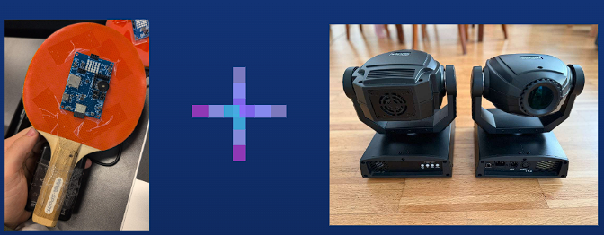
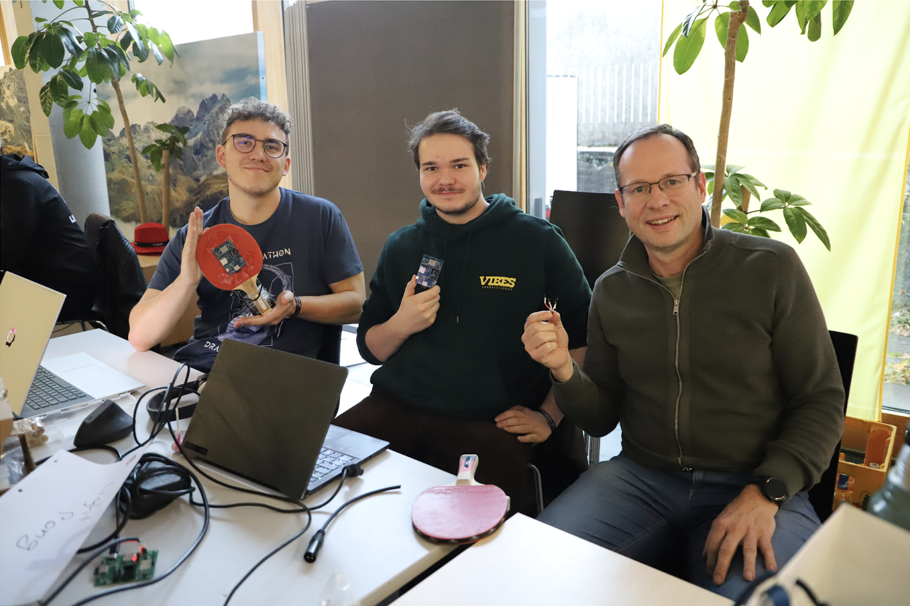
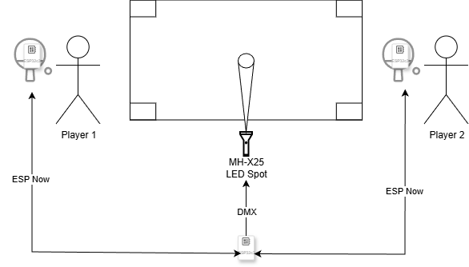

 

  

  <h3 align="center">Light Pong</h3>

  

    Tabletennis with light
     
     
    <a href="https://github.com/NeYoNmoos/Light-Pong/tree/main/Hackathon_Light_Pong_Client">View Client</a>
    &middot;
    <a href="https://github.com/NeYoNmoos/Light-Pong/tree/main/Hackaton_Light_Pong_Server">View Server</a>
  

# Light-Pong

A modern take on table tennis using projected light instead of a physical ball

Authors: Matthias Hefel, Elias Sohm

Institution: FH Vorarlberg

Course: Embedded Systems

## Overview

Light-Pong reimagines table tennis by replacing the physical ball with a projected light beam. Players swing their rackets through the air, and their movements control a light-based ball projected onto the playing surface, creating an innovative blend of physical activity and digital interaction.

## Team

Matthias Hefel
Elias Sohm

## Architecture

The system consists of three ESP32-C3 microcontrollers and one MH-X25 LED spotlight working in concert:

Server (1x ESP32-C3): Acts as the game controller, receiving accelerometer data and managing game logic
Clients (2x ESP32-C3): Embedded in table tennis rackets, transmitting movement data
LED Spotlight (MH-X25): Projects the light ball onto the playing surface

System Architecture

## Features

Racket Functionality

Motion Detection: Accelerometer-based hit detection with configurable threshold
Special Shot: Fireball mode with 10-second cooldown
Visual Feedback:

LED matrix displays current player score
Color gradient (green → red) indicates fireball cooldown status

Wireless Communication: ESP-NOW protocol for low-latency data transmission

Game Logic

Hit Validation: Server determines valid hits based on:

Current game state (whose turn it is)
Ball position relative to table edges

Score Tracking: Real-time score updates broadcast to rackets
Special Attacks: Fireball mechanic with cooldown management

## Hardware Components

ComponentQuantityPurposeESP32-C332x Client (rackets), 1x ServerMH-X25 LED Spotlight1Light ball projectionLED Matrix2Score/status display on racketsAccelerometer (built-in)2Motion detectionButton2Fireball activationTable Tennis Rackets2Player interfacePlaying Surface1Paper on table-height surface

## Project Structure

light-pong/  
├── Hackathon_Light_Pong_Client/ # ESP32 client code (rackets)  
│
└── Hackaton_Light_pong_Server/ # ESP32 server code (controller)  
│  
└── README.md

## Setup & Installation

### Media Coverage

Light-Pong was featured in the [VOL.AT Hackathon coverage:](https://www.vol.at/hackathon-100-studierende-48-stunden-eine-menge-kreativitaet/9806525)
Hackathon: 100 Studierende, 48 Stunden, eine Menge Kreativität
